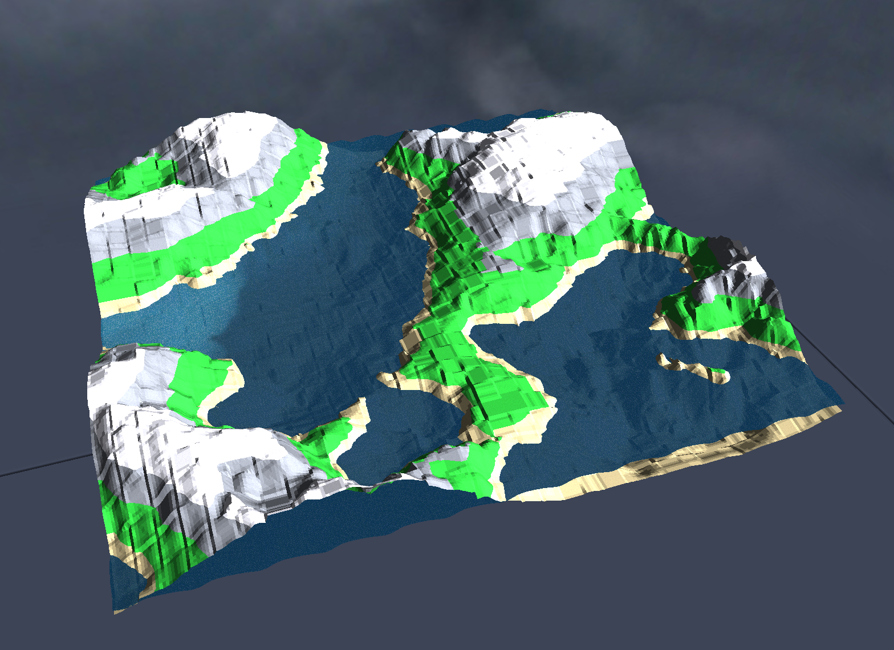

# Water Simulation with OpenGL

Features:

- Simulated water (with reflection/refraction and movements)
- Skybox
- Surrounding lands based on a height map, low-poly style



# To Launch

```
$ make && ./water
```

# Keyboard and mouse

- Directional arrows for moving
- Mouse for camera

- `m` for meshgrid mode
- `q` to increase waves' speed, `w` to decrease it
- `a` to increase waves' amount, `s` to decrease it
- `z` to increase waves' height, `x` to decrease it
